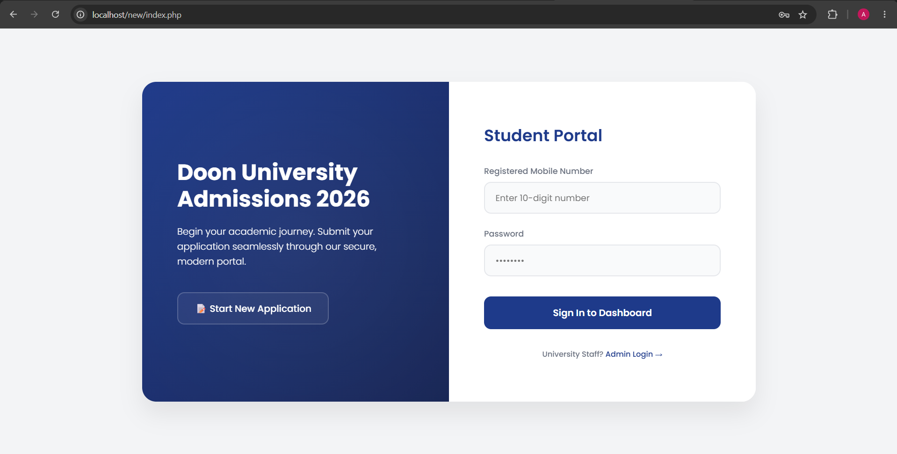
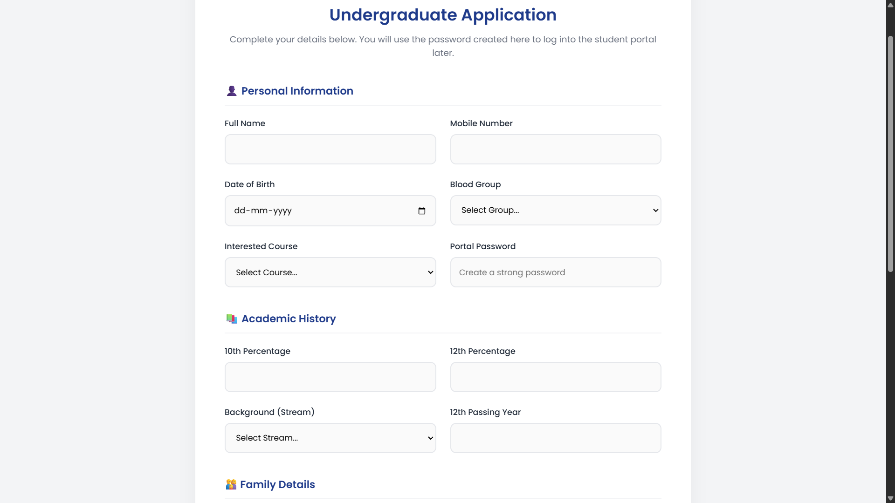
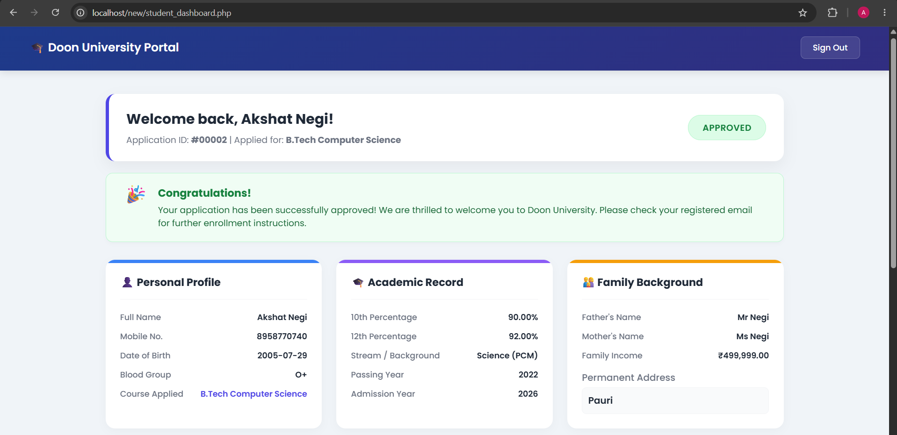
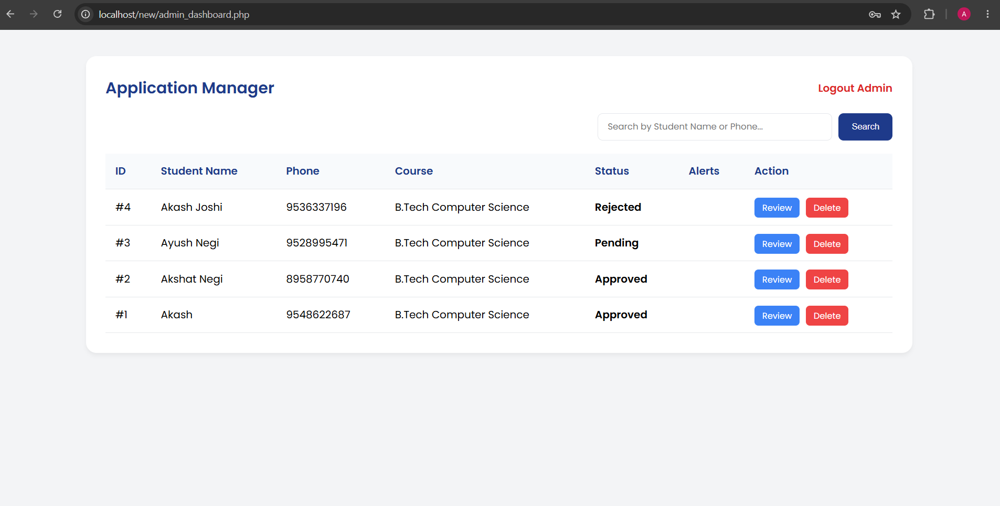

<div align="center">

  

  # 🎓 Doon University Admission Portal & Student Information System (SIS)

  ### A Full-Stack Web Application for Streamlined Student Admissions & Record Management

  <p>
    
    
    
    
    
    
  </p>

  <p>
    
    
    
  </p>

  <p>
    <b>A secure, role-based admission management platform built for real-world academic institutions —</b><br/>
    enabling students to apply, track, and manage their admission status, while empowering administrators<br/>
    with complete control over the applicant lifecycle.
  </p>

  <p>
    <a href="https://github.com/joshi-akash/student-portal"><b>🔗 View Repository</b></a>
  </p>

</div>

---

## 📖 Table of Contents

- [Overview](#-overview)
- [Key Features](#-key-features)
- [Tech Stack](#-tech-stack)
- [Screenshots](#-screenshots)
- [Project Architecture](#-project-architecture)
- [File Directory Breakdown](#-file-directory-breakdown)
- [Database Schema](#-database-schema)
- [Security Implementation](#-security-implementation)
- [Installation & Setup Guide](#-installation--setup-guide)
- [Usage Flow](#-usage-flow)
- [Future Enhancements](#-future-enhancements)
- [Author](#-author)
- [License](#-license)

---

## 🧭 Overview

The **Doon University Admission Portal & SIS** is a lightweight, dependency-free (no frameworks) full-stack application designed to digitize and simplify the university admission process. It replaces manual, paper-based admission workflows with a **dual-interface system** — one for prospective students, and one for administrative staff — built entirely on core **PHP**, **MySQL**, and **vanilla front-end technologies**, making it fast, portable, and easy to deploy on any standard **LAMP/XAMPP** stack.

The system emphasizes **clean UX**, **subtle CSS animations**, **data integrity**, and **secure authentication practices**, making it a strong demonstration of production-grade fundamentals without relying on heavyweight frameworks.

🔗 **Repository:** [github.com/joshi-akash/student-portal](https://github.com/joshi-akash/student-portal)

---

## ✨ Key Features

### 👨‍🎓 Student-Facing Portal
- 🔐 **Secure Registration & Login** — Students register using their **mobile number** and a password, encrypted using PHP's `password_hash()` (bcrypt).
- 📝 **Dynamic, Multi-Section Admission Form** — Captures:
  - Personal details (name, DOB, gender, contact, address)
  - Academic history (10th % and 12th % marks)
  - Family/guardian information
  - **Conditional sibling details** — a smooth CSS `@keyframes`-powered reveal section that only expands when the applicant indicates they have siblings, avoiding form clutter.
- 📊 **Real-Time Status Dashboard** — Track admission status live: `Pending` 🟡 → `Approved` 🟢 / `Rejected` 🔴.
- 💬 **Admin Remarks Viewer** — Read personalized notes/feedback left by admissions staff directly on the dashboard.
- 🔁 **Self-Service Password Reset Requests** — Students can raise a reset request without needing direct database access.

### 🛠️ Admin Control Panel
- 🗂️ **Full CRUD Management** — Create, Read, Update, and Delete any student record from a centralized dashboard.
- ✅ **Application Status Control** — Approve or reject applications with a single click.
- 🗨️ **Feedback Insertion** — Attach custom remarks/notes to any student profile, visible on their dashboard.
- 🔑 **Password Reset Handling** — Review and action student-submitted password reset requests securely.
- 📈 **Centralized Applicant Overview** — View all applications in a structured, sortable table format.

---

## 🧰 Tech Stack

| Layer | Technology |
|---|---|
| **Backend Logic** | PHP 8+ (Procedural, session-based auth) |
| **Database** | MySQL (via phpMyAdmin) |
| **Frontend Markup** | HTML5 (Semantic Structure) |
| **Styling** | CSS3 — Modern Minimalist Design, Flexbox/Grid, `@keyframes` Animations |
| **Interactivity** | Vanilla JavaScript (DOM manipulation, conditional field toggling, form validation) |
| **Local Server Environment** | XAMPP (Apache + MySQL + phpMyAdmin) |
| **Security** | `password_hash()` / `password_verify()`, PDO/MySQLi Prepared Statements, Input Sanitization |

---

## 🖼️ Screenshots

<table>
  <tr>
    <td align="center" width="50%">
      <b>🔐 Student Login Page</b><br/><br/>
      
      <br/>
      <sub>Mobile number & password-based secure authentication</sub>
    </td>
    <td align="center" width="50%">
      <b>📝 Registration / Application Form</b><br/><br/>
      
      <br/>
      <sub>Dynamic multi-section form with conditional sibling reveal</sub>
    </td>
  </tr>
  <tr>
    <td align="center" width="50%">
      <b>📊 Student Dashboard</b><br/><br/>
      
      <br/>
      <sub>Live application status & admin remarks</sub>
    </td>
    <td align="center" width="50%">
      <b>🛠️ Admin Dashboard</b><br/><br/>
      
      <br/>
      <sub>Full CRUD control panel for managing applicants</sub>
    </td>
  </tr>
</table>

---

## 🏗️ Project Architecture

```
┌─────────────────────┐        ┌──────────────────────┐        ┌────────────────────┐
│   STUDENT CLIENT     │        │     PHP APPLICATION   │        │   MYSQL DATABASE    │
│  (Browser / HTML-JS) │◄─────► │  (Business Logic Layer)│◄─────► │  (Data Persistence) │
└─────────────────────┘        └──────────────────────┘        └────────────────────┘
         │                               │                                │
         │  index.php (Login)           │  db.php (Connection Handler)   │
         │  admission_form.php          │  submit.php (Insert Logic)     │
         │  student_dashboard.php       │  update.php (Modify Logic)     │
         │                               │  delete.php (Remove Logic)     │
┌─────────────────────┐        ┌──────────────────────┐
│    ADMIN CLIENT      │        │   SESSION MANAGEMENT  │
│  admin_login.php      │◄─────►│   logout.php          │
│  admin_dashboard.php │        │   (PHP Sessions)       │
└─────────────────────┘        └──────────────────────┘
```

The application follows a **classic procedural MVC-inspired flow**: front-end HTML/CSS/JS forms submit data to dedicated PHP handler scripts, which interact with MySQL via a centralized `db.php` connection file, keeping database credentials and connection logic in one maintainable location.

---

## 📂 File Directory Breakdown

```
student-portal/
│
├── 🖼️ university_logo.png       # Static brand asset — displayed across login, dashboard & header UI
├── ⚙️ db.php                    # Centralized MySQL connection file (host, user, pass, db name)
│                                  used by every script that needs database access
│
├── 🔑 index.php                 # Entry point — Student Login page (mobile number + password)
│                                  Verifies credentials via password_verify() and starts a PHP session
├── 🔑 admin_login.php           # Dedicated Admin authentication gateway (separate credential set)
│
├── 📝 admission_form.php        # Core dynamic admission application form
│                                  Captures personal, academic, family & conditional sibling data
│                                  Sibling section revealed via CSS keyframe animation + JS toggle
├── 📤 submit.php                # Backend handler — validates & inserts admission_form.php data
│                                  into MySQL using prepared statements
├── ✅ success.php                # Confirmation page shown after successful form submission
│
├── 📊 student_dashboard.php     # Student-facing panel — displays real-time status (Pending/
│                                  Approved/Rejected), admin remarks, and password reset request option
│
├── 🛠️ admin_dashboard.php       # Admin control center — lists all applicants, triggers CRUD actions,
│                                  status updates, remark insertion & reset request management
├── ✏️ edit.php                  # Admin-side form to view & modify an individual student's full record
├── 🔄 update.php                # Backend handler — processes edits from edit.php and updates the DB
├── 🗑️ delete.php                # Backend handler — permanently removes a student record from the DB
│
├── 🚪 logout.php                # Universal session-destruction script for both student & admin roles
│
└── 📁 assets/                   # Screenshot images used in this README
    ├── student-login.png
    ├── admission-form.png
    ├── student-dashboard.png
    └── admin-dashboard.png
```

### 🔍 Architectural Role Summary

| File | Role Type | Description |
|---|---|---|
| `db.php` | **Core Utility** | Single source of truth for DB connectivity — `mysqli`/PDO instance reused across all files |
| `index.php` | **Auth (Student)** | Login gateway; validates hashed passwords, initializes session |
| `admin_login.php` | **Auth (Admin)** | Isolated login flow to separate admin privileges from student access |
| `admission_form.php` | **Data Entry** | Front-facing dynamic form with conditional JS/CSS logic |
| `submit.php` | **Create (C)** | Sanitizes & inserts new application data into MySQL |
| `success.php` | **Feedback UI** | Post-submission confirmation screen |
| `student_dashboard.php` | **Read (R)** | Student's personalized status-tracking view |
| `admin_dashboard.php` | **Read/Control Hub** | Master table view + action triggers for all CRUD operations |
| `edit.php` | **Update UI (U)** | Pre-filled form for editing a specific student record |
| `update.php` | **Update (U)** | Executes the SQL `UPDATE` query with sanitized inputs |
| `delete.php` | **Delete (D)** | Executes the SQL `DELETE` query for a given student ID |
| `logout.php` | **Session Control** | Destroys active session, redirects to login |
| `university_logo.png` | **Static Asset** | Branding image used in UI headers |

---

## 🗄️ Database Schema

> Example structure — adjust field names/types to exactly match your `students` table.

```sql
CREATE TABLE students (
    id INT AUTO_INCREMENT PRIMARY KEY,
    full_name VARCHAR(100) NOT NULL,
    mobile_number VARCHAR(15) UNIQUE NOT NULL,
    password VARCHAR(255) NOT NULL,          -- Stores bcrypt hash via password_hash()
    dob DATE,
    gender VARCHAR(10),
    address TEXT,
    tenth_percentage DECIMAL(5,2),
    twelfth_percentage DECIMAL(5,2),
    father_name VARCHAR(100),
    mother_name VARCHAR(100),
    has_siblings ENUM('yes','no') DEFAULT 'no',
    sibling_details TEXT NULL,               -- Populated only if has_siblings = 'yes'
    application_status ENUM('Pending','Approved','Rejected') DEFAULT 'Pending',
    admin_remarks TEXT NULL,
    reset_requested BOOLEAN DEFAULT FALSE,
    created_at TIMESTAMP DEFAULT CURRENT_TIMESTAMP
);
```

---

## 🔒 Security Implementation

This project follows core secure-coding practices suitable for handling sensitive student data:

- 🔐 **Password Hashing** — All user passwords are hashed using PHP's built-in `password_hash()` (bcrypt algorithm) at registration and verified using `password_verify()` at login. **Plaintext passwords are never stored.**
- 🛡️ **SQL Injection Prevention** — All database queries across `submit.php`, `update.php`, `delete.php`, and login scripts use **prepared statements** (via `mysqli`/PDO parameter binding) instead of raw string concatenation.
- 🧹 **Input Sanitization & Validation** — User inputs are sanitized/validated both client-side (JavaScript) and server-side (PHP) before touching the database, mitigating XSS and malformed data entry.
- 🚪 **Session-Based Access Control** — PHP sessions gate access to `student_dashboard.php` and `admin_dashboard.php`, redirecting unauthorized users back to the appropriate login page.
- 🔁 **Controlled Password Reset Flow** — Reset requests are logged and require **admin approval**, preventing unauthorized account takeovers.

```php
// Example: Secure password hashing during registration
$hashed_password = password_hash($_POST['password'], PASSWORD_BCRYPT);

// Example: Secure login verification
if (password_verify($_POST['password'], $stored_hash)) {
    // Authentication successful
}

// Example: Prepared statement (mysqli)
$stmt = $conn->prepare("SELECT * FROM students WHERE mobile_number = ?");
$stmt->bind_param("s", $mobile_number);
$stmt->execute();
```

---

## ⚙️ Installation & Setup Guide

Follow these steps to run the project locally using **XAMPP**.

### ✅ Prerequisites
- [XAMPP](https://www.apachefriends.org/) installed (includes Apache + PHP + MySQL + phpMyAdmin)
- A code editor (VS Code recommended)
- Basic familiarity with `localhost` development

### 📥 Step 1 — Clone the Repository
```bash
git clone https://github.com/joshi-akash/student-portal.git
```

### 📁 Step 2 — Move Project to htdocs
Copy the entire project folder into your XAMPP `htdocs` directory:
```
C:\xampp\htdocs\student-portal\
```
*(On macOS/Linux: `/Applications/XAMPP/htdocs/` or `/opt/lampp/htdocs/`)*

### ▶️ Step 3 — Start Apache & MySQL
Open the **XAMPP Control Panel** and click **Start** next to:
- `Apache`
- `MySQL`

### 🗃️ Step 4 — Create the Database
1. Navigate to `http://localhost/phpmyadmin`
2. Click **New**, and create a database named:
   ```
   doon_university_sis
   ```
3. Select the new database, go to the **SQL** tab, and run the schema script (see [Database Schema](#-database-schema) above) to create the `students` table.
4. *(Optional)* Create a separate `admins` table for administrator credentials, and insert an initial admin record with a hashed password.

### 🔧 Step 5 — Configure `db.php`
Open `db.php` and update the connection credentials to match your local MySQL setup:

```php
<?php
$host = "localhost";
$db_user = "root";
$db_pass = "";              // Default XAMPP MySQL password is empty
$db_name = "doon_university_sis";

$conn = new mysqli($host, $db_user, $db_pass, $db_name);

if ($conn->connect_error) {
    die("Connection failed: " . $conn->connect_error);
}
?>
```

### 🌐 Step 6 — Launch the Application
Open your browser and navigate to:
```
http://localhost/student-portal/index.php
```

- **Student Access:** `index.php` → Register/Login → `admission_form.php` → `student_dashboard.php`
- **Admin Access:** `admin_login.php` → `admin_dashboard.php`

✅ You're all set! The portal should now be fully functional on your local environment.

---

## 🔄 Usage Flow

```
STUDENT JOURNEY
index.php (Register/Login) → admission_form.php (Apply) → submit.php (Save) 
   → success.php (Confirmation) → student_dashboard.php (Track Status)

ADMIN JOURNEY
admin_login.php (Login) → admin_dashboard.php (View All Applicants)
   → edit.php / update.php (Modify Record)
   → delete.php (Remove Record)
   → Status/Remarks Update (Approve/Reject + Feedback)
```

---

## 🚀 Future Enhancements

- [ ] Email/SMS notifications on status change
- [ ] OTP-based mobile verification during registration
- [ ] Document/certificate upload support (10th/12th marksheets)
- [ ] Admin analytics dashboard (charts for applicant trends)
- [ ] Migration to PDO with full MVC structure
- [ ] Role-based multi-admin access levels

---

## 👨‍💻 Author

**Akash Joshi**

Full-Stack Developer | PHP & MySQL Enthusiast

[](https://github.com/joshi-akash)
[](https://linkedin.com/in/akash-joshi-100808431)
[](https://github.com/joshi-akash/student-portal)

---

## 📄 License

This project is licensed under the **MIT License** — feel free to use, modify, and distribute with attribution.


<div align="center">

  ### ⭐ If you found this project useful, consider giving it a star on <a href="https://github.com/joshi-akash/student-portal">GitHub</a>!

  <sub>Built with ❤️ and countless cups of chai by <b>Akash Joshi</b></sub>

</div>
